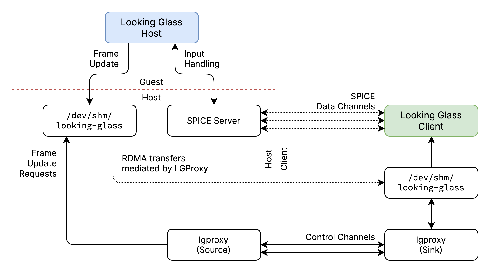

.. Telescope Looking Glass Proxy documentation master file, created by
   sphinx-quickstart on Fri Apr 15 15:22:00 2022.
   You can adapt this file completely to your liking, but it should at least
   contain the root `toctree` directive.

.. include:: subs.rst

Documentation for LGProxy |GITVER|
==================================

.. toctree::
   :maxdepth: 2
   :caption: Contents:

Introduction
************

LGProxy is a high-performance proxy for the Looking Glass application. It
utilizes the Telescope Remote Framebuffer Library for transport over both
commodity and RDMA capable networking hardware.

You can view our `GitHub repository
<https://github.com/telescope-proj/lgproxy>`_, or download our project thesis
:download:`here <https://public.cdn.timd.io/TelescopeProjectThesisPub.pdf>`.

Developed by the :doc:`team/team`.

Table of Contents
=================

* :ref:`genindex`

.. toctree::
   :caption: Getting Started

   user/requirements
   user/installation
   user/building
   user/running
   user/runlg
   user/optimizations

.. toctree::
   :caption: Support

   help/faq
   help/format
   help/knownbugs

.. toctree::
   :caption: Team

   team/team

.. toctree::
   :caption: Legal

   legal/licenses
   legal/impressum

