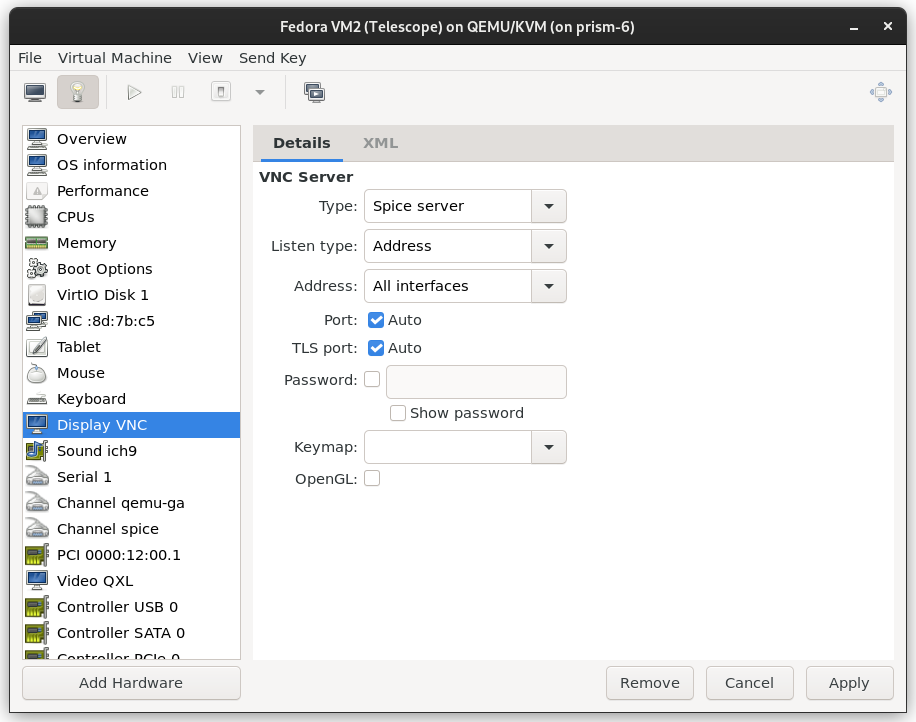

.. _runlg:

Running Looking Glass under LGProxy
===================================

Enabling SPICE network support
------------------------------

.. warning::

    This exposes your VM SPICE channel at all times. To expose it only when
    needed, you can instead open it only to localhost and use ncat on-demand.
    This configuration is not covered in the docs.

If you have not configured your VM's SPICE server to listen on external
interfaces, you must do so. On the server side / side running the VM, you can do
this within the virt-manager application as follows:

Running
-------

The LGProxy client should be run before starting the Looking Glass client. You
can use the same features as if you were running Looking Glass locally.

However, to enable audio, keyboard, and mouse support, you must specify the
SPICE server location and enable capturing the mouse on startup with the ``-c
server`` and ``spice:captureOnStart=yes`` options.

Example:

.. code-block:: bash

    ./looking-glass-client -c 172.22.0.1 spice:captureOnStart=yes -f /dev/kvmfr0

Troubleshooting
~~~~~~~~~~~~~~~

If you encounter issues, see the support section of this documentation for
solutions to common problems as well as how to report bugs.